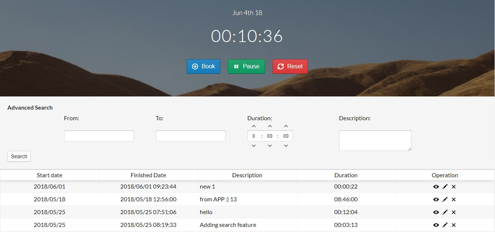

# Time Tracker

This project is a simple time tracking application to allow you to manage your working time.



## Getting Started

### Prerequisites

You'll need to install:

 * PHP (Minimum 7)
 * PhpMyAdmin
 * Symfony 4
 * React 16.3

## Installing

You could install php and phpMyAdmin by installing XAMPP.

and then run

```
$ composer install
```

Then you need to install client side requirements

```
npm install
```

To add some dummy data to the project please create new database called timer_ticker and import timer_ticker.sql through phpMyAdmin

## Usage

To run the project you need to open two terminal

After navigating to the server folder you could run the server-side application.
If you are using XAMPP, do not forget to run Apache and MySQL

```
$ php bin/console server:run
```

then in the client folder you need to run the below command

```
npm start
```

### Built With
* [Symfony](https://symfony.com/doc/current/index.html) - The back-end framework used for preparing REST API
* [React](https://reactjs.org/) - Used in front-end to build user interface
* [Blueprint](https://reactjs.org/) - A React-based UI toolkit to make UI more beautiful
* [Redux](https://redux.js.org/) - A state management for JavaScript Appps
* [Redux Form](https://reactjs.org/) - Managing the form state in Redux
* [Lodash](https://lodash.com/) - helps you to write code in an Functional programming / immutability approach

## Authors

See the list of [contributors](https://github.com/sheidaee/time-tracker/contributors) who participated in this project.

## License

This project is licensed under the MIT License - see the [LICENSE.md](LICENSE.md) file for details.